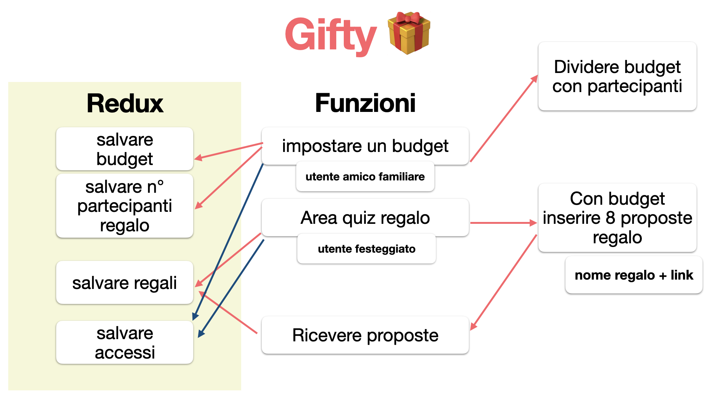

# 🎁 Gifty

Gifty è un'app web per creare e condividere **liste regali con budget**.
Il festeggiato crea una lista, aggiunge i suoi desideri e condivide il link;
chi organizza il regalo apre lo stesso link, vede le proposte e imposta il budget.

> Nessun login obbligatorio: ogni lista vive su un link condivisibile.
> Una sessione **anonima** Firebase viene creata automaticamente.



## ✨ Funzionalità

- Crea una lista regali e condividila tramite link (copia negli appunti).
- Aggiungi, modifica ed elimina i desideri (max 8 per lista, max 80 caratteri).
- Imposta un budget per la lista.
- Disponibile offline tramite service worker (Create React App).
- Login Google **opzionale**.

## 🧱 Stack

React 15 · Redux + Redux Thunk · React Router 4 · Firebase 3 (Auth + Realtime Database) · Create React App.

## ✅ Prerequisiti

- [Node.js](https://nodejs.org) **≥ 6**
- Un progetto [Firebase](https://console.firebase.google.com) con:
  - **Authentication** → provider **Anonimo** abilitato (e, se vuoi, Google).
  - **Realtime Database** attivo.

## 🚀 Setup

```bash
# 1. Installa le dipendenze
npm install

# 2. Configura Firebase
cp .env.example .env
# poi inserisci in .env i valori del tuo progetto (REACT_APP_FIREBASE_*)

# 3. Avvia in sviluppo
npm start
```

L'app gira su <http://localhost:3000>.

> Le Web API key di Firebase sono pubbliche per design: la sicurezza è garantita
> dalle regole in [`database.rules.json`](database.rules.json), non dalla segretezza della chiave.

## 🔒 Regole del database

Le regole di sicurezza sono in [`database.rules.json`](database.rules.json): accesso solo a
sessioni autenticate (anche anonime), con validazione di budget e desideri.

## 🧹 Formattazione

```bash
npm run format    # Prettier
```

## 📦 Build & Deploy

```bash
npm run build     # build di produzione in /build
npm run deploy    # build + firebase deploy (hosting + regole database)
```

## 📄 Licenza

[MIT](LICENSE)
